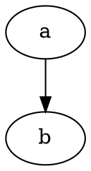

# The Linux Programming Note

## 1. gcc编译器

### 1.1 gcc编译的四个阶段(ESc)

```text
hello.c  -------->   hello.i  -------->    hello.s  -------->    hello.o  ------->    hello.out
预处理编译器（cpp）   编译器（gcc）          汇编器（as）           链接器（ld）
gcc -E              gcc -S                 gcc -c                gcc
```

### 1.2 编译工具链:

```text
预处理编译器: cpp    gcc -E hello.c -o hello.i   头文件展开，宏替换，注释去掉
编译器: gcc          gcc -S hello.i -o hello.s   c文件变成汇编文件
汇编器: as           gcc -c hello.s -o hello.o   汇编文件变成二进制文件
链接器: ld           gcc hello.o -o hello        将函数库中相应的代码组合到目标文件中
```

### 1.3 编译时指定宏，通常用于调试代码-D

```gcc hello.c -D DEBUG```

```c
在需要打印日志的代码中加上下面的语句：
#ifdef DEBUG
    printf("debug info");
#endif
```

### 1.4 编译时对代码进行优化-O3

```gcc hello.c -o hello -O3```

```text
    级别：
    0   没有优化
    1   缺省值
    3   优化级别最高
```

### 1.5 编译时显示告警信息-Wall

```gcc hello.c -o hello -Wall```

### 1.6 编译时包含调试信息-g（gdb）

```gcc hello.c -o hello -g```

## 2. 静态库的创建和使用

### 2.1 目录结构

```text
myCalc
├── include
│   └── head.h
├── lib
│   └── libMyCalc.a
├── main.c
└── src
    ├── add.c
    ├── div.c
    ├── mul.c
    ├── sub.c
```

### 2.2 构建

```shell
gcc *.c -c -I ../include
ar rcs libMyCalc.a *.o
nm libMyCalc.a
gcc main.c lib/libMyCalc.a -I include -o myapp
gcc main.c -I include -L lib -l MyCalc -o myapp
```

## 3. 动态库的创建和使用

### 3.1 目录结构

```text
myCalc
├── include
│   └── head.h
├── lib
│   └── libMyCalc.so
├── main.c
└── src
    ├── add.c
    ├── div.c
    ├── mul.c
    ├── sub.c
```

### 3.2 构建

``` shell
gcc -fPIC *.c -c -I ../include
gcc -shared -o libMyCalc.so *.o -I ../include
nm libMyCalc.so
gcc main.c lib/libMyCalc.so -I include -o myapp
gcc main.c -I include -L lib -l MyCalc -o myapp
ldd myapp
export LD_LIBRARY_PATH=./lib
动态库的路径写到配置文件中
vi /etc/ld.so.conf
/home/super/myCalc/lib
ldconfig -v
```

## 4. gdb调试

### 4.1 查看代码

```text
gdb app
>>>(gdb) l #list
>>>(gdb) l 行号或函数名
>>>(gdb) l 文件名:行号或函数名
```

### 4.2 设置断点

```text
设置条件断点
>>>(gdb) b 10 if value==19
删除断点
>>>(gdb) d 断点的编号    #delete或del
>>>(gdb) i b            #info, 可以获取断点的编号，删除断点时用
```

### 4.3 执行gdb调试

```text
>>>(gdb) start          #只执行一步
>>>(gdb) c              #continue，直接停在断点的位置
>>>(gdb) run            #有断点会停在断点处，没有会直接跑完程序，较少用
>>>(gdb) s              #进入函数体内部
>>>(gdb) finish         #从函数体内部跳出
>>>(gdb) n              #不进入函数体内部
>>>(gdb) u              #退出当前循环
>>>(gdb) p  print       #查看变量的值
>>>(gdb) ptype 变量名    #查看变量类型
>>>(gdb) set var 变量=值 #设置变量的值
```

### 4.4 设置追踪变量

```text
>>>(gdb) display 变量        #设置追踪变量
>>>(gdb) info display        #获取变量的编号
>>>(gdb) undisplay 编号       #取消追踪变量
```

### 4.5 退出

```text
>>>(gdb) quit
```

## 5. Makefile

### 5.1 Makefile的规则

```makefile
# 规则中的三要素：目标、依赖、命令
# makefile文件内容格式

# 目标：依赖文件
#    命令

# makefile文件内容简单示例

app: main.c add.c sub.c mul.c div.c
    gcc main.c add.c sub.c mul.c div.c -o app

# 第二行必须有一个tab缩进
```

### 5.2 子目标和终极目标

```makefile
#终极目标
app: main.o add.o sub.o div.o
    gcc main.o add.o sub.o div.o -o app
#子目标
main.o: main.c
    gcc -c main.c
#子目标
add.o: add.c
    gcc -c add.c
#子目标
sub.o: sub.c
    gcc -c sub.c
#子目标
mul.o: mul.c
    gcc -c mul.c
#子目标
div.o: div.c
    gcc -c div.c
```

### 5.3 Makefile两个函数

- wildcard：取得目录下的所有文件
- patsubst：将目标下的所有文件作替换
- 示例

```makefile
#自定义变量
src=$(wildcard ./*.c)
obj=$(patsubst ./%.c, ./%.o, $(src))
target=app
#终极目标
$(target):$(obj)
    gcc $(obj) -o $(target)
#子目标
%.o:%.c
    gcc -c $< -o $@
```

### 5.4 makefile的变量

#### 普通变量

- 变量取值：foo = $(obj)
- 由Makefile维护的一些变量
- 通常格式都是大写
  - CC: 默认值是cc
- 有些有默认值，有些没有
  - CPPFLAGS: 预处理器需要的选项，如：-I
  - CFLAGS: 编译的时候使用的参数 -Wall -g -c
  - LDFLAGS: 链接库使用的选项 -L -l
- 用户可以修改这些变量的默认值
  - CC = gcc

#### 自动变量

```text
变量
    $< 规则中的第一个依赖条件
    $@ 规则中的目标
    $^ 规则中的所有依赖条件
    以上三种变量只能在规则的命令中使用
模式规则
    在规则的目标定义中使用%
    在规则的依赖条件中使用%
```

```makefile
#自定义变量
src=$(wildcard ./*.c)
obj=$(patsubst ./%.c, ./%.o, $(src))
target=app
#makefile维护的变量
CC = gcc
CPPFLAGS = -I
#终极目标
$(target):$(obj)
    $(CC) $^ -o $@
#子目标
%.o:%.c
    $(CC) -c $< -o $@
#伪目标
.PHONY:clean
clean:
    #命令前面加-表示，如果命令执行失败则忽略这个命令
    -mkdir /release
    rm -f $(obj) $(target)
```

## 6. 系统IO函数

### 6.1 C库IO函数工作流程



## Console shortcut


## File type

-, d, l, b, c, s, p

## Command

```shell
ln -s hello.c hello.soft
wc hello.c # line, words, bytes, filename
od -tc hello.o # c, d, f, o, u, x
chmod a=x hello
chmod a-x hello
chmod a+x hello
find ~ -size -10k
find ~ -size +10M
find ~ -size +10M -size -100M
find ~ -type p # -type d/f/b/c/s/p/l
mkfifo test
grep -r "stdio.h" ~
sudo apt-get clean # /var/cache/apt/archives
sudo dpkg -r sublime-text
sudo fdisk -l
sudo mount /dev/sdb1 /mnt # sd: SCSI Device hd: Hard Disk sda5: main partition 1-4, extend 5-
tar xvfz abc.tar.gz -C /tmp
# Ctrl + ALT + F1-F7
# Ctrl + Shit + t : new tab
ps aux # a:all u:user x:terminal
kill -l
ping www.yahoo.com -c 4
nslookup www.baidu.com
sudo adduser zhangsan
sudo deluser zhangsan
sudo groupadd dev
sudo useradd -s /bin/bash -g dev -d /home/lisi -m lisi
sudo passwd lisi
sudo userdel -r lisi
sudo apt install vsftpd # /etc/vsftpd
service vsftpd restart
sudo apt install lftp
sudo apt install nfs-kernel-server # /etc/exports /home/zhangsan/share *(rw, sync)
sudo service nfs-kernel-server restart
sudo mount 192.168.100.9:/home/zhangsan/share /mnt
sudo apt install openssh-server # scp: super copy
man man
alias ls
alias pse='ps -ef'
vi hello.c # /etc/vim/vimrc ~/.vim/vimrc
# 500G S s d0 D ctrl+r v->y ? # >> 3K I :%s/zhang/li/g :3,5s/zhang/li/g
# qall ZZ :sp ctrl+ww :vsp stdio.h
gcc hello.c # -ESc .c-.i-.s-.o cpp gcc as ld
ar rcs libcalc.a *.o
gcc hello.c -I./include -D DEBUG -O3 -Wall -g
ar rcs libcalc.a *.o
gcc main.c lib/libcalc.a -Iinclude
gcc main.c -L lib -l calc -Iinclude
nm libcalc.a
nm a.out
gcc -fPIC -c *.c
gcc -shared -o libcalc.so -I../include *.o
gcc main.c lib/libcalc.so -Iinclude
ldd a.out
echo $LD_LIBRARY_PATH
sudo vi /etc/ld.so.conf
sudo ldconfig -v
apt install gdb
gdb app
# list, l hello.c:98, l hello.c:test, b 12, b 15 if i == 15
# break info, start, next, continue, step, print i, ptype max, display i, i d, undisplay 1
# u, finish, set var i = 10, run, delete
make # makefile Makefile
```

```makefile
# CC CPPFLAGS CFLAGS  
src=$(wildcard ./*.c)
obj=$(patsubst ./%.c, ./%o, $(src))
target=app

$(target):$(obj)
    $(CC) $^ -o $(target)

%.o:%.c
    $(CC) -c $< -o $@

.PHONY:clean
clean:
    -mkdir /test
    rm $(obj) $(target) -f

hello:
    echo "hello, world"

```

```shell
file app
```

## Linux API

### Basic API

```c
off_t lseek(int fd, off_t offset, int whence);
int stat(const char *pathname, struct stat *statbuf);
int access(const char *pathname, int mode);
int chmod(const char *pathname, mode_t mode);
long int strtol(const char *nptr, char **endptr, int base);
int chown(const char *pathname, uid_t owner, gid_t group);
int truncate(const char *path, off_t length);
int link(const char *oldpath, const char *newpath);
int symlink(const char *target, const char *linkpath);
ssize_t readlink(const char *pathname, char *buf, size_t bufsiz);
int unlink(const char *pathname);
int rename(const char *oldpath, const char *newpath);
int chdir(const char *path);
char *getcwd(char *buf, size_t size);
int mkdir(const char *pathname, mode_t mode);
int dup(int oldfd);
int dup2(int oldfd, int newfd);
int fcntl(int fd, int cmd, ... /* arg */ );
```

### C Library

```c
DIR *opendir(const char *name);
struct dirent *readdir(DIR *dirp);
int closedir(DIR *dirp);
```

## Examples

1. [Lib generator command](examples/1.lib_gen/README.md)
2. [File, directory and dup](example/../examples/2.file_dir/README.md)
